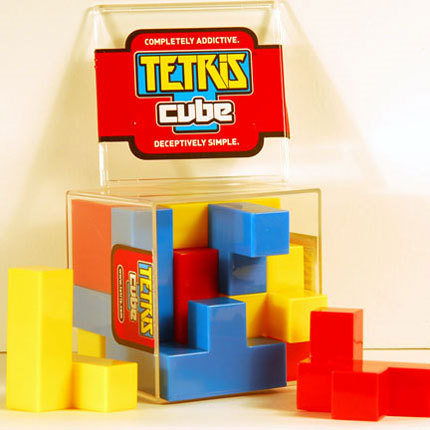

## Puzzle

The puzzle consists of 12 pieces with must fit into a 4x4x4 volume. The manufacturer claims there are 9839 possible solutions.



Images of all the pieces are in the `docs` folder.

## Installation

Install the required python dependencies

```bash
apt-get install python3-dev
pip3 install -r requirements.txt 
```

Build the C++ solver

```bash
cd src
make
```


## Solution

## Possible Improvements

- Use the python's FFI to C/C++ to merge the two programs together
- Support NxNxN puzzles with arbitrary pieces
- Leverage NVIDIA CUDA to parallelize compute using a GPU